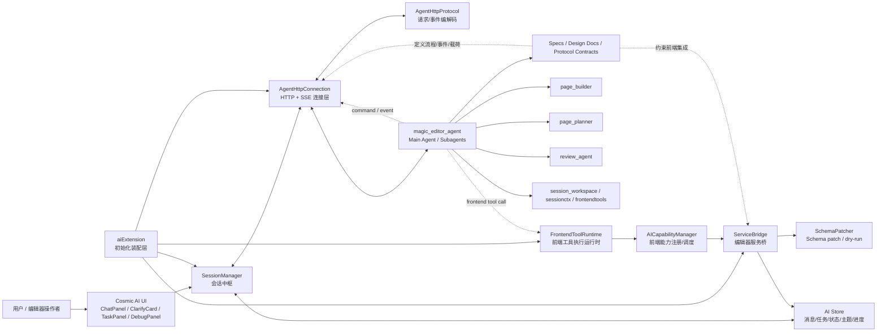
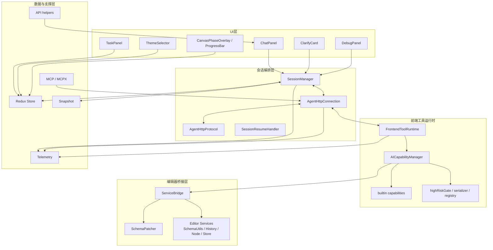
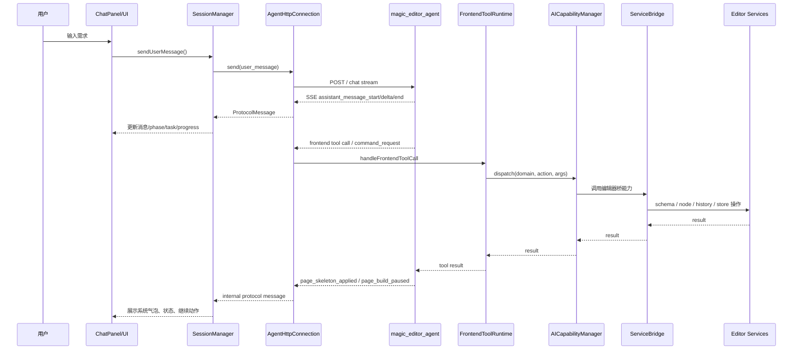
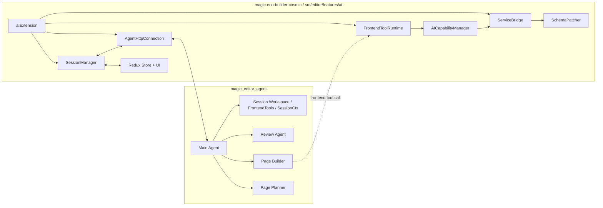

# Builder AI 架构图（magic_editor_agent × magic-eco-builder-cosmic）

## 1. 结论

- **前端 Builder AI 真正实现**在：
  - `/Users/bytedance/yewq/code/live_campaign_monorepo/packages/apps/campaign/packages/magic/magic-eco-builder-cosmic/src/editor/features/ai`
- **`magic_editor_agent` 仓库**主要承担：
  - 后端 agent 编排
  - 协议/流程设计
  - page builder / planner / review 等子 agent 能力实现
  - 面向前端 AI 模块的接口契约与文档来源
- 两者关系可以概括为：
  - **cosmic = 前端 AI Runtime + Editor Bridge + UI**
  - **magic_editor_agent = 后端 Agent Orchestration + Domain Logic + Specs**

---

## 2. 总体架构图

---

## 3. 两个仓库的职责边界

### 3.1 magic-eco-builder-cosmic：前端 Builder AI

目录：
- `src/editor/features/ai/session`
- `src/editor/features/ai/capability`
- `src/editor/features/ai/bridge`
- `src/editor/features/ai/extensions`
- `src/editor/features/ai/components`
- `src/editor/features/ai/store`
- `src/editor/features/ai/telemetry`
- `src/editor/features/ai/snapshot`

核心职责：
- 管理 AI 会话生命周期
- 发起聊天请求，消费后端 SSE
- 维护消息流、任务流、状态流、思考流
- 将后端 tool call / capability call 映射到前端编辑器能力
- 把 schema/page/node/material/history 等编辑器操作封装成可调用桥接能力
- 把 AI 状态渲染为 UI（聊天面板、澄清卡、进度、任务板等）

### 3.2 magic_editor_agent：后端 Builder AI

仓库中可见重点：
- `agent/main_agent`
- `agent/subagents/page_builder`
- `agent/subagents/page_planner`
- `agent/subagents/review_agent`
- `agent/kernel/session_workspace`
- `agent/kernel/sessionctx`
- `biz/service/frontendtools`
- 大量 `docs/`、`specs/`

核心职责：
- 负责主 agent 和多子 agent 编排
- 负责页面规划、页面搭建、页面 review、活动配置等后端逻辑
- 负责 session / workspace / frontend tools / tool governance 等后端基础设施
- 通过协议向前端发：
  - assistant stream
  - page_skeleton_applied
  - page_build_paused
  - clarify_request
  - tool_progress
  - orchestration snapshot / task update 等
- 消费前端提供的：
  - frontend_context
  - capability_report
  - 前端工具调用结果

---

## 4. cosmic 前端 AI 模块分层图

---

## 5. 关键模块说明

### 5.1 `extensions/aiExtension.ts`

作用：**装配入口**。

负责：
- 创建 `ServiceBridge`
- 创建 `FrontendToolRuntime`
- 创建 `AgentHttpConnection`
- 将连接/runtime/bridge 注入到 session 与编辑器扩展环境
- 初始化 AI 能力、页面上下文、会话恢复、MCP bridge 等

可以把它理解为：
- **AI 功能在编辑器中的启动器 / IoC 装配层**

---

### 5.2 `session/SessionManager.ts`

作用：**前端 AI 会话总控**。

负责：
- 连接 adapter
- 发送 `user_message`
- 自动发送 `capability_report`
- 处理后端协议消息：
  - `assistant_message_*`
  - `clarify_request`
  - `page_skeleton_applied`
  - `page_build_paused`
  - `tool_progress`
  - `task_update`
  - `page_review_*`
- 维护排队消息、自动 continue、停止生成、错误态、placeholder、去重逻辑
- 驱动 redux store 更新 UI

它是整个前端 AI 的**状态机中枢**。

---

### 5.3 `session/AgentHttpConnection.ts`

作用：**和后端 agent 的 HTTP/SSE 通道适配器**。

负责：
- 发起 chat 请求
- 处理 SSE 流
- 将后端事件翻译为前端内部 `ProtocolMessage`
- 处理停止生成 `/api/chat/stop`
- 解析重要载荷：
  - `page_skeleton_applied`
  - `page_build_paused`
  - `node_id_mapping -> NodeIdBinding`
- 将后端 frontend tool call 转交 `FrontendToolRuntime`

它更像：
- **网络协议入口 + SSE 消费器 + 前端事件适配器**

---

### 5.4 `session/AgentHttpProtocol.ts`

作用：**协议编解码工具层**。

负责：
- 构造 chat request body
- 序列化 `frontend_context`
- 序列化 `page_context`
  - `product_key`
  - `platform`
  - `component_skill_overrides`
- 解析 SSE buffer
- 将 tool call payload 转成结构化 command request

它是：
- **协议 DTO / serializer / parser 层**

---

### 5.5 `session/FrontendToolRuntime.ts`

作用：**后端 agent 调前端工具时的实际执行器**。

负责：
- 接收后端的 frontend tool call
- 调用前端 capability manager
- 返回 tool result
- 维护前端工具注册状态
- 作为“后端 agent -> 前端编辑器能力”之间的执行 runtime

它是：
- **前端工具 RPC runtime**

---

### 5.6 `capability/AICapabilityManager.ts`

作用：**前端 AI 能力注册中心 + 调度中心**。

负责：
- 注册能力
- 校验 channel / availability / 风险等级
- 统一 dispatch 能力调用
- 对接 telemetry
- 绑定 `ServiceBridge`
- 聚合 builtin capability

典型能力域包括：
- `editor`
- `schema`
- `page`
- `canvas`
- `style`
- `component`
- `material`
- `preview`
- `history`
- `ui`
- `system`

它是：
- **前端工具总线**

---

### 5.7 `bridge/ServiceBridge.ts`

作用：**AI 能力到编辑器内部服务的桥**。

负责：
- 读写 page schema
- 执行 patch / merge / remove
- 增删组件
- 查询页面结构
- 应用 page skeleton
- 调用 history 记录实现 undo/redo
- 对接节点操作 / store / schema service

这是 AI 模块与编辑器内核的**真实落地点**。

---

### 5.8 `bridge/SchemaPatcher.ts`

作用：**受控 schema patch 引擎**。

负责：
- patch draft 到 page
- merge / remove 字段
- dry-run 预演
- 输出 warnings / errors

它解决的是：
- “AI 生成 schema 修改如何安全落地到编辑器页面”

---

### 5.9 `store/store.ts`

作用：**AI 前端状态仓库**。

承载数据：
- 聊天消息
- 当前 phase
- loading / error
- clarify 卡片状态
- task board / orchestration snapshot
- tool progress
- component skill overrides
- selected theme / status hint

它是：
- **所有 AI UI 的单一前端状态源**

---

## 6. 前后端调用链

### 6.1 用户发起一次搭建请求

---

## 7. `page_skeleton_applied` / `page_build_paused` 在体系里的位置

这两个事件是当前 builder ai 链路里的关键“页面构建阶段事件”。

### `page_skeleton_applied`
表示：
- 后端已经决定并触发了一次页面骨架应用
- 前端收到后会：
  - 回显系统消息
  - 更新任务/阶段信息
  - 带上 `nodeIdMapping`

### `page_build_paused`
表示：
- 页面构建到某个 checkpoint 暂停
- 前端收到后会：
  - 记录暂停原因 / workspaceSessionId / version
  - 根据策略自动 continue 或等待人工继续

这两个事件的载荷在 cosmic 中已经统一收敛到：
- `Record<string, NodeIdBinding>`
而不是旧的 `Record<string, string>`。

---

## 8. magic_editor_agent 对应的后端分层理解

虽然前端实现不在 agent 仓库里，但 agent 仓库能看到完整的后端意图来源：

### 8.1 Agent 层
- `main_agent`
- 各类 `subagents`
  - `page_builder`
  - `page_planner`
  - `review_agent`
  - `play_config_builder`
  - 其他活动构建相关 agent

### 8.2 Kernel / Session 基础设施
- `session_workspace`
- `sessionctx`
- `toolgovernance`
- `skills`
- `ltm`

### 8.3 Frontend Tools 后端支撑
- `biz/service/frontendtools`

这说明后端已经把“前端工具”视为正式工具层的一部分，前端 cosmic AI 模块并不是孤立 UI，而是整个 agent system 的一个**可被调用的前端执行端**。

---

## 9. 可以怎么理解这套 Builder AI

可用一句话总结：

> **Builder AI = 后端 agent 负责规划与决策，前端 cosmic AI 负责协议消费、编辑器能力执行、状态管理和可视化反馈。**

拆开看：
- 后端负责“想什么、决定做什么”
- 前端负责“怎么在编辑器里执行、怎么让用户看见、怎么让用户继续交互”

所以它不是简单聊天机器人，而是：
- **Agent Orchestration + Frontend Tool Runtime + Editor Bridge + Task/Review UI**

---

## 10. 关键源码观察点

如果后续要继续深挖，建议优先读这些文件：

### 前端 cosmic
- `src/editor/features/ai/extensions/aiExtension.ts`
- `src/editor/features/ai/session/SessionManager.ts`
- `src/editor/features/ai/session/AgentHttpConnection.ts`
- `src/editor/features/ai/session/AgentHttpProtocol.ts`
- `src/editor/features/ai/session/FrontendToolRuntime.ts`
- `src/editor/features/ai/capability/AICapabilityManager.ts`
- `src/editor/features/ai/bridge/ServiceBridge.ts`
- `src/editor/features/ai/bridge/SchemaPatcher.ts`
- `src/editor/features/ai/store/store.ts`

### 后端 agent
- `agent/main_agent/*`
- `agent/subagents/page_builder/*`
- `agent/subagents/page_planner/*`
- `agent/subagents/review_agent/*`
- `biz/service/frontendtools/*`
- `agent/kernel/session_workspace/*`
- `docs/play_and_page/*`
- `docs/prd-to-page-render-build-flow.md`

---

## 11. 最终摘要图

